.. _plotting-options:

Plotting the Results
====================

In this section, we will outline various plotting options of MDANSE.

There are two tabs in the GUI which deal with data plotting.
"Plot Creator" is used for loading the data files and selecting
the specific data sets to be plotted, and is shown in
:numref:`figure-plot-empty`.

.. _figure-plot-empty:

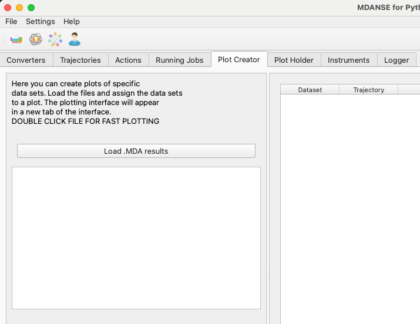

   At first, the plot creator does not contain any data files.

"Plot Holder" stores individual plots in separate tabs. The
currently selected plot tab is the one that will receive new data
sets. The "Plot Data" button in the Plot Creator sends
the currently selected data sets to the current plot in
the Plot Holder.

Every time you perform an action in the Plot Creator
tab that has an effect on the contents of the Plot Holder,
the Plot Holder tab will be highlighted in the GUI
(see :numref:`figure-plot-loaded`).

Loading the Results
~~~~~~~~~~~~~~~~~~~

The MDANSE GUI can load the .mda files, which are the output of different
analysis types. When you load the files in the Plot Creator tab,
they will appear in the tree view on the left.

.. _figure-plot-loaded:

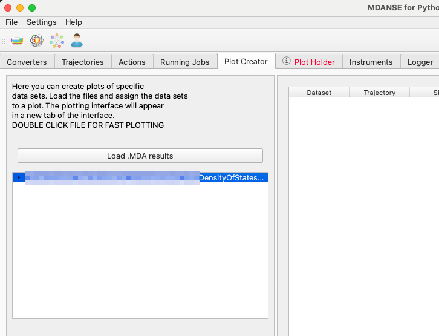

   Plot Holder is highlighted, since a new plot has been created.

Viewing the Results
~~~~~~~~~~~~~~~~~~~

Quick Plot
----------

Once a file has been loaded into the Plot Creator tab, a quick plot
can be created by double-clicking a entry. All new plots will appear in
the next GUI tab, called "Plot Holder".

Double-clicking a single
dataset will create a new plot of this dataset in the Plot Holder tab.
Double-clicking a data group will create a plot of all the datasets
directly in the group (but not recursively in other groups inside this one.)

Finally, double-clicking a file name will create a plot of the main results
contained inside the file. For each analysis type, MDANSE marks several
datasets as "main" results
and as "partial" results. The datasets with the tag "main" will be shown
in a quick plot, and those with the tag "partial" will additionally be
set to the dashed line style.

If you need to combine different datasets in a single plot, especially
datasets originating from different files, you will have to select
the plot contents manually.

Manual Plotting
---------------

Selecting the datasets manually is slower, but offers greater control
over the contents of the plot. In this approach, datasets from several
files can be put in a single plot, allowing them to be compared directly.

In Plot Creator, you can unfold the tree view of a data file. All the data
sets will be listed there, and clicking any of them will add them to the
list of data sets to be plotted.

Typically, you will want to use the "New Plot" button first to create an
empty plot. The Plot Holder will automatically make the new plot the
active one, so you can just click "Plot Data" afterwards to send your
selected data sets to the new plot.

Once you have switched to the Plot Holder tab, you can further customise
the specific plots.

.. _plotter-csv-output:

Data as Text
------------

You can view the data as numbers in the plotting interface by creating
a "New Data View (Text)" instead of a "New Plot". This will create a tab
in the Plot Holder which visualises data as text. You can send data sets
to that text view the same way as to a plot, by clicking "Plot Data".

The text view will recalculate the data axes according to the currently
selected physical units, the same as it is done in plots. It can also
be used for saving the data to a text file, in CSV format.

Plot types
~~~~~~~~~~

Single
------

All the data sets will be shown on a single set of axes
(see :numref:`figure-plot-dos-single`).
This is useful for comparing similar data sets. Sliders
under the plot can be used to add offsets between curves,
which can be applied to check if some of the curves are
overlapping in the plot.

.. _figure-plot-dos-single:

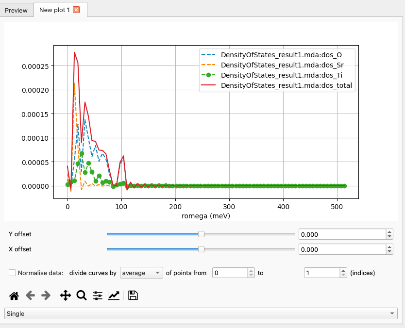

   Density of States results as a "Single" plot.

Grid
----

Each data set is plotted on its own axes
(see :numref:`figure-plot-dos-grid`).
Sliders are not used in this plotting mode.

.. _figure-plot-dos-grid:

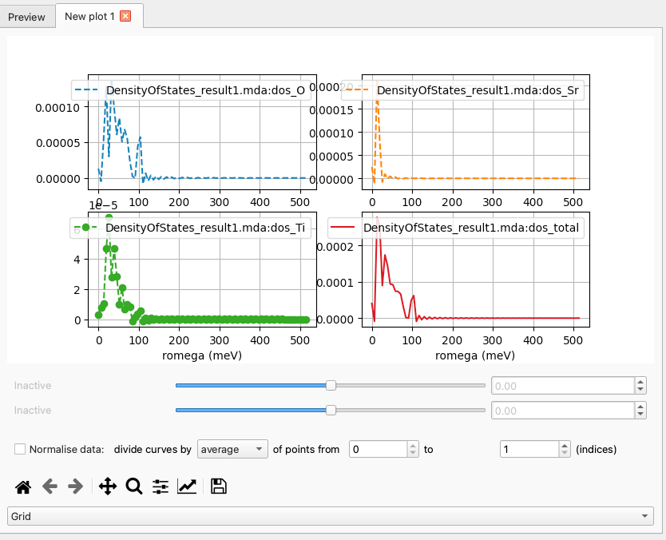

   Density of States results as a "Grid" plot.

Heatmap
-------

A 2D heat map (:numref:`figure-plot-sqf-heatmap`) plot
can be used for 2D and 3D data sets.
The sliders can adjust the maximum and minimum values on the
colour bar.

.. _figure-plot-sqf-heatmap:

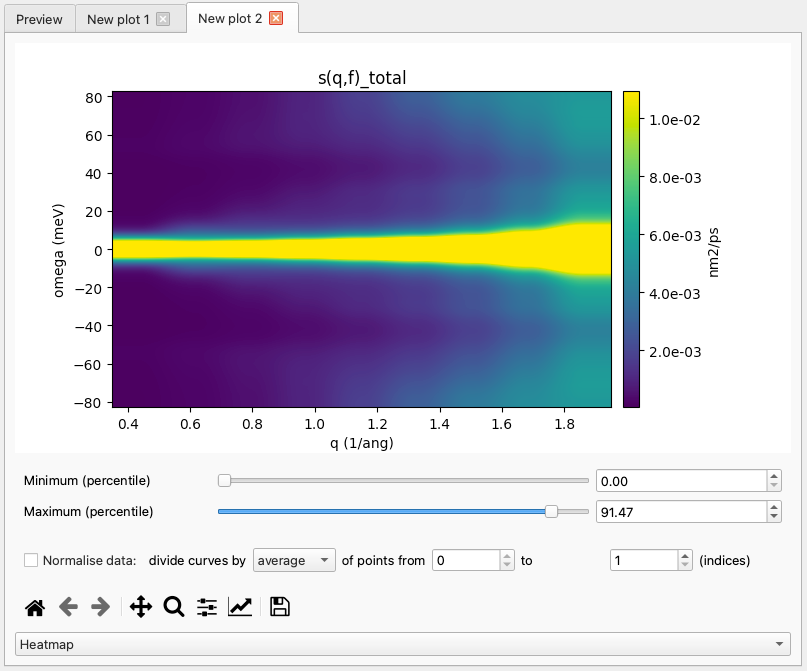

   Dynamic Coherent Structure Factor of water as a "Heatmap" plot.

The orientation of a 2D array can be changed by specifying a different
main axis of the plot (:numref:`figure-plot-sqf-mainaxis`).

.. _figure-plot-sqf-mainaxis:

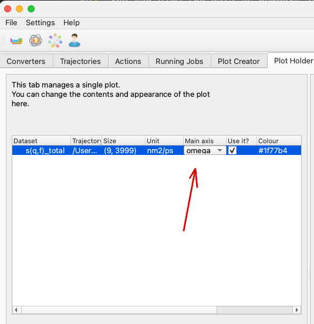

   The axis chosen here will become the x axis of the plot.

Changing the main axis will result in an updated plot
(:numref:`figure-plot-sqf-heatmap-newaxis`).

.. _figure-plot-sqf-heatmap-newaxis:

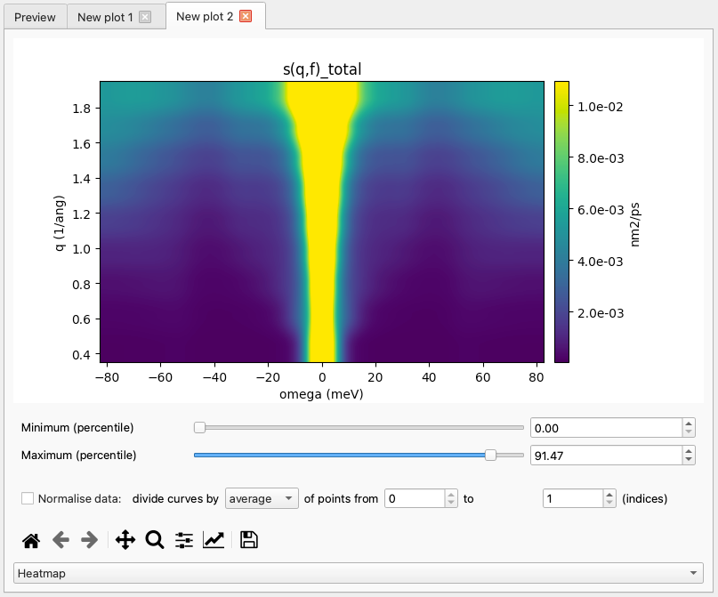

   The same 2D array is now plotted against the energy axis.

Saving the Data
~~~~~~~~~~~~~~~

Basic saving
------------

It is possible to save the data as they are presented (including
modifications, shifts and normalisations) to file for further
processing. These data are saved in an annotated ``.csv`` format for
transferability and ease of use.

Each data block (axis, line) starts with a commented header-line
(using ``#`` as a comment marker) detailing the contents of the block.

.. note::

   Because of potentially mismatched axes (e.g. due to numerical
   rounding) it is not possible to stack multiple lines side-by-side in
   the output data file.

Advanced saving
---------------

If you do not wish to save all multi-plot data to the same file, it is
possible to use some magic strings in the filename to dump each axis
or line to its own file.

These strings are ``%axis%``, ``%line%``. If these are present in the
filename, the data will be split into multiple files with ``%axis%``
and ``%line%`` replaced with the respective axis or line index.

Customising the Plot
~~~~~~~~~~~~~~~~~~~~

Matplotlib settings
-------------------

Analysis results are plotted using the matplotlib library.
It offers many options of customising the plots, including
some like the figure dimensions and DPI value which have
to be set before a new plot is created.

MDANSE saves the matplotlib parameters in its own configuration
file, and offers a simple interface for modifying the settings.
Plot Creator tab includes a button for accessing the plot settings
(:numref:`figure-matplotlib-button`).

.. _figure-matplotlib-button:

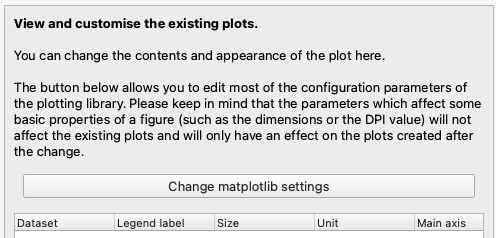

   This button ("Change matplotlib settings") opens the plot settings dialog.

For each configuration entry, both the current value and the default
value are shown. Changes to the current values are applied immediately,
and should affect the existing plots wherever possible. The configuration
dialog is shown in :numref:`figure-matplotlib-settings`. Here, the filter
field has been used to find the entries containing the word "figure",
and the user has changed the figure DPI value from 100 to 300.

.. _figure-matplotlib-settings:

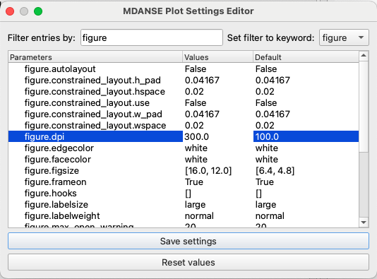

   This change will affect only the new plots and not the existing ones.

If the changes introduced here should become permanent, it is possible
to save them using the "save settings" button. They will be stored in
MDANSE configuration and loaded automatically next time MDANSE_GUI
is started. To completely undo all the changes, you can use the other button,
"reset values", which sets all the parameters back
to the matplotlib default values.

Global settings
---------------

Global settings of the plotter affect the appearance of the plots
and the preferred physical units used for plotting. They can be changed
in the Plot Holder using the part of the GUI in :numref:`figure-plot-global`.

.. _figure-plot-global:

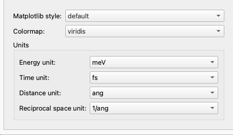

   These settings will be applied to all plots.

Plot-specific settings
----------------------

The side panel of the Plot Holder (:numref:`figure-plot-dos-details`)
contains the settings affecting the appearance of the individual curves.
Specifically:

- the "Legend label" is the text that will be used for this curve
  in the plot legend,
- the "Use it?" checkbox can be unchecked to remove a curve
  from the plot; the text input field next to it can be used
  to select a subset of 1D curves from a 2D or 3D dataset.
- the "Marker" field changes the point marker used for a data set,
- the "Line style" field changes between solid, dashed and dotted lines,
- the "Colour" field can change the colour of a curve,
- the "Apply weights" checkbox can be unchecked to remove the scaling
  factor applied according to the weights scheme (See also :ref:`weighting-scheme`).

Currently, the line style, marker and colour settings are ignored
for 2D arrays. As there is only one table entry per data set, setting
all the curves from a 2D data set to a single colour, style or marker
type would make it difficult to distinguish between specific curves.

.. _figure-plot-dos-details:

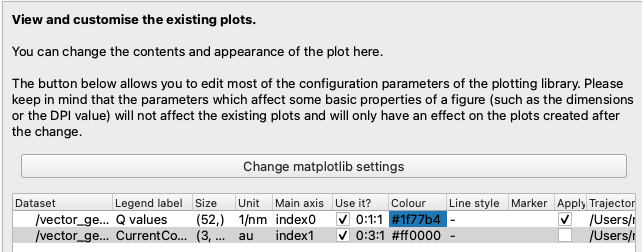

   These settings will automatically update the plot when changed.

Additionally, the plots in MDANSE are created using matplotlib,
and the can use the standard matplotlib toolbar to switch the
plot axes to logarithmic scale.

Slicing a 2D array
------------------

You can use a subset of curves from a single data set by specifying
their array indices in the "Use it?" field. Examples in
:numref:`figure-plot-sqf-details` and :numref:`figure-plot-sqf-details-slice`
show how to select a single curve, or several curves separated by a fixed
step, respectively.

.. _figure-plot-sqf-details:

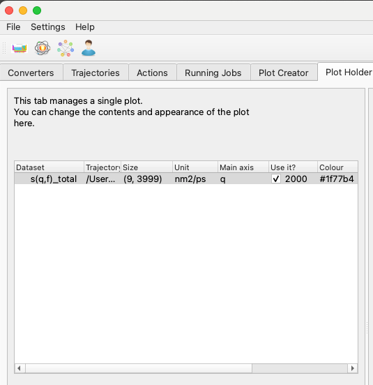

   A single 1D curve will be plotted.

.. _figure-plot-sqf-details-slice:

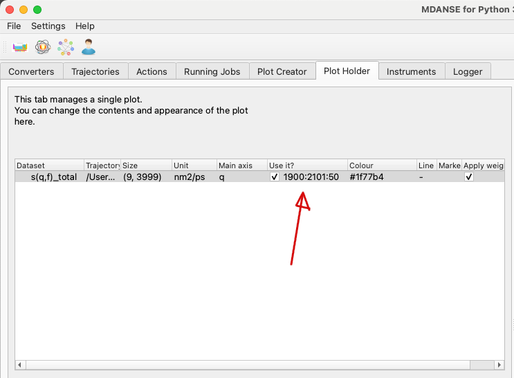

   Five 1D curves will be plotted. The numbers in the "Use it?"
   field are in the "first:last:step" format.

While the curves are selected based on their index in the 2D array,
the plot legend will contain information about their position
on the physical axes of the data set, as shown in
:numref:`figure-plot-sqf-onecurve`.

.. _figure-plot-sqf-onecurve:

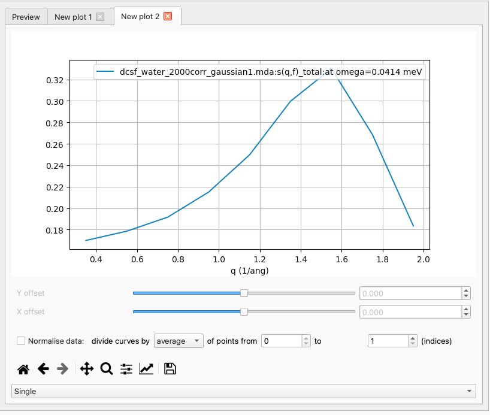

   The legend of the plot shows which part of the 2D data set
   is represented by this curve.
