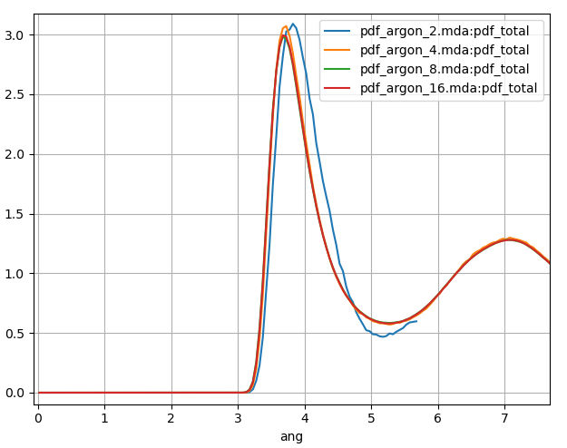
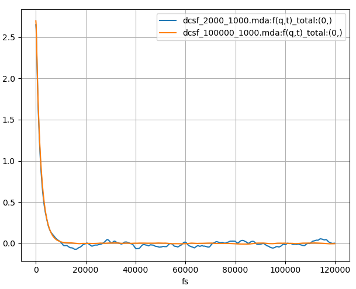
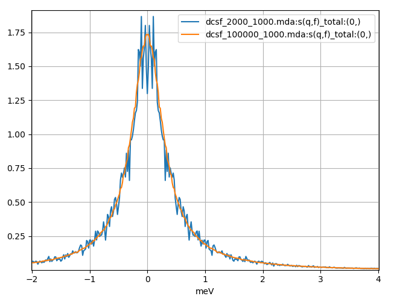
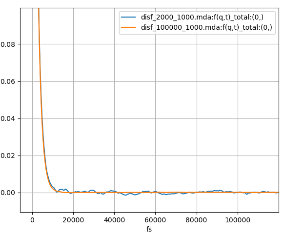
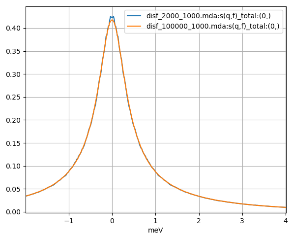
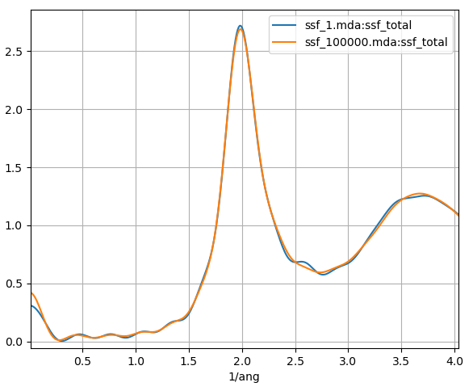

Obtaining Converged Results
===========================
In MD, a large number of settings must be chosen correctly to ensure that
high quality results are obtained. Some of these include the size of the MD
box, the time step and the simulation length. The choice of these settings
also depends on the type of intended analysis; for example, the dynamic
coherent structure factor is much more difficult to converge
when compared to the dynamics incoherent structure factor. In this section
we will show how the calculation results change with different MD settings
for a simple liquid argon system.

Simulation Box Size
~~~~~~~~~~~~~~~~~~~

Pair Distribution Function
--------------------------
Here we run a liquid argon trajectory with four different simulation box
sizes: 1.146, 2.292, 4.584 and 9.168 nm. The same atom density,
temperature, time step and simulation length are used for all cases. We
calculate the pair distribution function for all trajectories.

.. _figure-pdf:

   PDF calculated for a 120 ps MD simulation of liquid argon with a
   number of different MD box sizes. Blue, orange, green and red plots
   correspond to MD box sizes of 1.146, 2.292, 4.584 and 9.168 nm
   respectively.

In :numref:`figure-pdf` we show the results for the PDF plotted to half
the box size. Our smallest box size 1.146 nm (blue in :numref:`figure-pdf`)
is small enough for the periodic image of the argon atoms to have a
significant effect on itself. Compared to our largest system size, the
first peak is shifted to a slightly longer distance, is too high and too broad.

Simulation Length
~~~~~~~~~~~~~~~~~

Dynamic Coherent Structure Factor
---------------------------------
For analysis types which calculate a correlation function,
a balance between the length of your correlation function and the number of
configurations that you average over for each time step must be reached.
Here we run dynamic coherent structure factor calculations using
the liquid argon trajectory with the 4.584 nm box size, ideal
instrument resolution and two different correlation frames settings.

.. _figure-coh-fqt:

   The coherent intermediate scattering function calculated for 120 ps
   from a 240 ps and 12 ns MD simulation of liquid argon plotted in blue
   and orange respectively.

.. _figure-coh-sqw:

   The dynamic coherent structure factor calculated from a Fourier
   transform of the above coherent intermediate scattering functions
   using a 240 ps and 12 ns MD simulation of liquid argon plotted in blue
   and orange respectively.

In the first calculation (blue in :numref:`figure-coh-fqt` and :numref:`figure-coh-sqw`), we
use a correlation frames setting of (0, 2000, 1, 1000). The first
and last frames will be 0 and 2000 and the number of time
steps of the correlation function will be 1000. This will mean that for
this calculation each time step of the correlation function will be
averaged over 1001 = 2000 -- 1000 + 1 configurations. For the blue plot in
:numref:`figure-coh-fqt` we can see :math:`F(q, t)` oscillate around zero;
after Fourier transforming we obtain a noisy :math:`S(q, f)` which is
especially poor around zero energy.

In the second calculation (orange in :numref:`figure-coh-fqt` and :numref:`figure-coh-sqw`),
we use a correlation frames setting of (0, 100000, 1, 1000). It means that each time
step of the correlation function will be averaged over 99001 = 100000 -- 1000 + 1
configurations, but will still be the same length as the first calculation. Visually,
we can see that :math:`F(q, t)` decay and stay closer to zero, and after Fourier
transforming we obtain a much smoother :math:`S(q, f)`. There is still
some noise; perhaps an even longer trajectory would be required. Clearly for dynamic
coherent structure factor calculations, to obtain high quality results longer
trajectories are needed so that a larger number of configurations are used per
time step of the correlation function.

In both calculations the number of correlation function time steps was set to 1000, which
corresponds to a time of 120 ps. From the :math:`F(q, t)`, we can see that
this is sufficiently long to ensure that the correlation function decays
to zero. We can see that it does not change significantly beyond 30 ps or so.
For other calculations or systems this might not be the case and a
more careful choice for the correlation frames may be required.

Dynamic Incoherent Structure Factor
-----------------------------------
Here we run the dynamic incoherent structure factor calculations using the same
liquid argon system and correlation frames settings as in the dynamic coherent
structure factor calculations above.

.. _figure-inc-fqt:

   The incoherent intermediate scattering function calculated for 120 ps
   from a 240 ps and 12 ns MD simulation of liquid argon plotted in blue
   and orange respectively.

.. _figure-inc-sqw:

   The dynamic incoherent structure factor calculated from a Fourier
   transform of the above incoherent intermediate scattering functions
   using a 240 ps and 12 ns MD simulation of liquid argon plotted in blue
   and orange respectively.

In contrast to the coherent calculations, there
are only minor differences between calculations with the (0, 2000, 1, 1000) and
(0, 100000, 1, 1000) correlation frames settings, results shown in blue
and orange in :numref:`figure-inc-fqt` and :numref:`figure-inc-sqw` respectively.
We can see that the incoherent calculation requires a much smaller number of
configurations per time step to approach convergence.

Static Structure Factor
-----------------------
Unlike the previous two calculations, the static structure factor does
not require the calculations of a correlation function. The quality of
your results will depend on the length of your trajectory (among a number
of other things) but obviously there will not be a correlation frames
setting to specify.

.. _figure-ssf-conv:

   The static structure factor using a single frame of an MD simulation
   and a 12 ns MD simulation of liquid argon plotted in blue and orange
   respectively.

In :numref:`figure-ssf-conv` we plot the static structure factor
calculated from a single frame of an MD simulation and a 12 ns MD
simulation. We can see that even when we use a single frame, the SSF is
quite close to the results from the 12 ns MD simulation. This occurs
since converged results can be obtained for large system sizes or
long trajectories. The argon trajectory used contain a total of 2048
atoms which appears to be sufficient to obtain enough statistics for
good static structure factor results, so that only a short MD
simulation would be required.

Simulation Time Step
~~~~~~~~~~~~~~~~~~~~

Dynamic Coherent Structure Factor
---------------------------------
The DCSF calculation probes the dynamics of the MD trajectory at
different distances and time scales. For example, for smaller :math:`q` values
correspond to larger wavelength and time scales while larger :math:`q`
values correspond to smaller distances and time scales. To obtain accurate
DCSF results we therefore need much smaller time steps for the larger
values of :math:`q`. Here we plot the DCSF for liquid argon using a
time step of 0.12 and 1.2 ps.