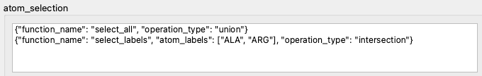
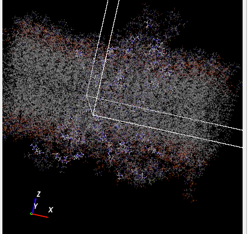
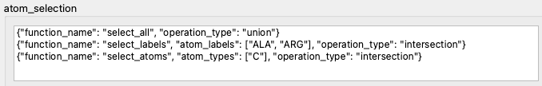

.. _atom-selection:

Atom Selection
==============

An analysis does not have to include all the atoms present in the system.
For large, complicated or inhomogeneous systems it may be beneficial to select
subsets of atoms, and perform analysis on those subsets.
This can be done by applying atom selection.

Atom Selection Mechanism
~~~~~~~~~~~~~~~~~~~~~~~~

To demonstrate a basic selection example, we take
`a trajectory <https://www.ccpbiosim.ac.uk/slim-md/slimmd-database/protein-membrane/human-dopamine-transporter-embedded-in-a-membrane-bound-to-mdma-250ns>`_
from the SlimMD database. It is a trajectory of human dopamine transporter embedded
in a membrane and bound to MDMA, from
`a publication by Sahai et al. <https://doi.org/10.1016/j.pnpbp.2016.11.004>`_.
This system consists of 46981 atoms, but the selection we apply (:numref:`atom-selection-simple`)
limits the atom set to just two types of amino acids, alanine and arginine.
The selection helper dialog shows a 3D view in which the deselected
atoms are rendered as transparent, and where we can see individual
amino acids which are now selected (:numref:`atom-selection-viewer`)

.. _atom-selection-simple:

   The selection originally contains all atoms (line 1), but is then limited
   to two specific amino acids.

.. _atom-selection-viewer:

   The 3D View of the selection from :numref:`atom-selection-simple`.

It is possible to add further levels of refinement. We can, for example,
narrow the selection down to only the carbon atoms in these amino
acids (:numref:`atom-selection-deeper`). Note that in the second and
third lines of the selection we apply the intersection operation,
which is an equivalent of the logical AND operator. As a result,
we end up having selected atoms which are carbon atoms AND 
belong to alanine or arginine amino acids.

.. _atom-selection-deeper:

   The selection originally contains all atoms (line 1). It is then limited
   to two specific amino acids, alanine and arginine (line 2). Finally,
   only the carbon atoms in there amino acids are included in the selection
   (line 3).

It is important to note that the same selection sequence could be used
to select these amino acids in any other protein system that contained them.

Reusable Selection
------------------

The current design choice in MDANSE is to create an atom selection in a way
that allows it to be used with different trajectories.
This is achieved by specifying the selection as a sequence of operations,
each one of them producing a set of atom indices.

A simple example of a reusable atom selection is this sequence:

1. Select all water molecules,
2. Invert selection.

This can be applied in a meaningful way to a wider group of trajectories,
such as macromolecules solvated by water. For each trajectory, this sequence
will remove the solvent from the selection, allowing us to run the analysis
on the macromolecule itself.

**Selection Output**: The result of applying a selection to a trajectory is a set of atom indices.
In MDANSE, atoms are indexed from 0 to N-1 in a system with N atoms.
Every analysis file contains a mask array in which every atom is assigned
a 1 if it was included in the selection, or 0 if it was not selected.

**Selection Input**: The input of atom selection is a sequence of selection operations,
as shown in :numref:`atom-selection-simple` and :numref:`atom-selection-deeper`.
Each operation returns a set of atom indices, and user input specifies
how each set should be included in the existing selection.

This selection definition is also saved in the analysis output file,
and can be loaded into the GUI from an MDA file to be used again
for a different analysis run or for a different trajectory.

**Set Operations**: Three standard set operations are implemented in the atom selection:

- **Union**:
  For sets A and B, their union :math:`A \cup B` contains all elements of A and all elements of B.

- **Intersection**:
  For sets A and B, their intersection :math:`A \cap B` contains only those elements that belong
  to both A and B.

- **Difference**:
  For sets A and B, their difference :math:`A \setminus B` contains only those elements that belong
  to A and at the same time do not belong to B.

Selection Criteria
------------------

Atoms can be selected based on several criteria.

**Index**: The number assigned to an atom in a trajectory.
It does not carry any physical meaning, and so it is not
transferable between trajectories. It can still be used in
a meaningful way for a single trajectory. Indices can be specified
as

- a **list** :math:`1,2,3`,
- a **range** :math:`1\text{-}30`,
- a Python-style **slice** :math:`1:30:7`, in
  the format of first:last:step.

**Chemical Element**: You can specify a selection using specific chemical elements.
All atoms of the requested types will be selected. 

**Atom Name**: An atom is not guaranteed to have a distinct name, and by default
it is assign a name that is the same as its chemical element.
However, some MD engines can use names that are more specific
than the chemical element labels, differentiating between
atom positions in a molecule, etc. This information is normally
saved in an MDANSE trajectory and can be used to select atoms.

**Label**: If the MD engine had some additional information about the structure
of the system, this information will typically be saved as a 'label'
in MDANSE. For example, trajectories using PDB files for their topology
description will normally have residue name assigned to atoms. This
residue name will be stored as a label associated with an atom.

**Position**: Atoms can be selected based on their positions, by specifying
limits in x,y, and z (selection inside a cuboid) or within
a distance from a specific point in space (selection inside
a sphere). Since atom positions are time-dependent in an
MD trajectory, the selection based on position has to be
performed for a specific trajectory frame.

**Molecule**: If the topology of the system contains molecule definitions,
this information can be used in atom selection. It is possible
to select all atoms belonging to molecules of a specific type.

If you know that the system contains molecules, but the molecule
list in MDANSE is empty, please run the TrajectoryEditor on the
trajectory with the "Search for molecules" option, and molecules
will be identified based on interatomic distances and covalent radii.

**SMARTS Patterns**: The `SMARTS <https://www.daylight.com/dayhtml/doc/theory/theory.smarts.html>`_
(SMILES arbitrary target specification) functionality
in MDANSE is still very limited, since
MDANSE does not differentiate between different types of chemical
bonds. Therefore, the SMARTS strings provided by MDANSE do
not specify the bond type, and any custom strings input by
the user need to follow the same approach. A methyl group
can currently be found using a SMARTS string
[#6;H3](~[H])(~[H])~[H]. We intend to add the missing information
to the system topology in the future.

**Manual Selection**: It is possible to select atoms by clicking each one of them
in the 3D view. This will create a list of indices that can be used
as a selection. The selection helper dialogs offers buttons that can
confirm or undo the current manual selection, so intermediate steps of
the manual selection can be saved.

Atom Selection Results
~~~~~~~~~~~~~~~~~~~~~~

In MDANSE, the scaled total results from a calculation with selection will always
be a fraction of the total results (i.e. when all atoms are selected). This is
done so that, for example, the total results from two calculation, one with a
selection and the other with its inverse selection, add up to give the total results
for the calculation will all atom selected. For example, the DCSF and DISF
with selection is

.. math::
   :label: selection1

   F_{\text{coh},\alpha\beta}{(\mathbf{q},t) =  \frac{1}{N \sqrt{c_{\alpha\, \cap\, s}c_{\beta\, \cap\, s}}}}{\sum\limits_{j \in (\alpha\, \cap\, s)}{\sum\limits_{k \in (\beta\, \cap\, s)} \left\langle {\exp\left\lbrack {{- i}\mathbf{q}\cdot\mathbf{r}_{j}\left( 0 \right)} \right\rbrack\exp\left\lbrack {i\mathbf{q}\cdot\mathbf{r}_{k}\left( t \right)} \right\rbrack} \right\rangle}},

.. math::
   :label: selection2

   F_{\text{inc},\alpha}{(\mathbf{q},t ) = \frac{1}{N c_{\alpha\, \cap\, s}}}{\sum\limits_{j \in (\alpha\, \cap\, s)} \left\langle {\exp\left\lbrack {{- i}\mathbf{q}\cdot\mathbf{r}_{j}\left( 0 \right)} \right\rbrack\exp\left\lbrack {i\mathbf{q}\cdot\mathbf{r}_{j}\left( t \right)} \right\rbrack} \right\rangle}

where :math:`N` is the total number of all atoms,
:math:`c_{\alpha\, \cap\, s} = N_{\alpha\, \cap\, s} / N`, and :math:`N_{\alpha\, \cap\, s}`
is the total number of :math:`\alpha` atoms in the selection. With selection,
the DCSF and DISF weights are

.. math::
   :label: selection4

   W_{\alpha\beta} = \left[2 - \delta_{\alpha\beta}\right]\frac{\sqrt{c_{\alpha\, \cap\, s}c_{\beta\, \cap\, s}} b_{\mathrm{coh},\alpha}b_{\mathrm{coh},\beta}}{\sum_{\gamma\delta} c_{\gamma}c_{\delta}  b_{\mathrm{coh},\gamma}b_{\mathrm{coh},\delta}}

and

.. math::
   :label: selection5

   W_{\alpha} = \frac{c_{\alpha\, \cap\, s} b_{\mathrm{inc},\alpha}^2}{\sum_{\gamma} c_{\gamma} b_{\mathrm{inc},\gamma}^2}

so that the normalisation factors on the weights do not depend on the selection.
The total DCSF and DISF results are a weighted sum of the partial terms

.. math::
   :label: selection3

    F_{\text{coh}}(\mathbf{q},t) = \frac{N}{N_{s}} \sum_{\alpha}\sum_{\beta \geq \alpha} W_{\alpha\beta} F_{\text{coh},\alpha\beta}(\mathbf{q},t), \quad  F_{\text{inc}}(\mathbf{q},t) = \frac{N}{N_{s}} \sum_{\alpha} W_{\alpha} F_{\text{inc},\alpha}(\mathbf{q},t).

where :math:`N_s` is the total number of selected atoms. This way the
total results are equivalent to the a system which only contains those
atoms, assuming the weights normalisation factor is unchanged. The
total result from a selection can also be rescaled so that it is a fraction
of the total results with all atoms selected

.. math::
   :label: selection4

    \mathcal{F}_{\text{coh}}(\mathbf{q},t) = \frac{N_{s}}{N} F_{\text{coh}}(\mathbf{q},t), \qquad  \mathcal{F}_{\text{inc}}(\mathbf{q},t) = \frac{N_{s}}{N} \sum_{\alpha} W_{\alpha} F_{\text{inc},\alpha}(\mathbf{q},t).
