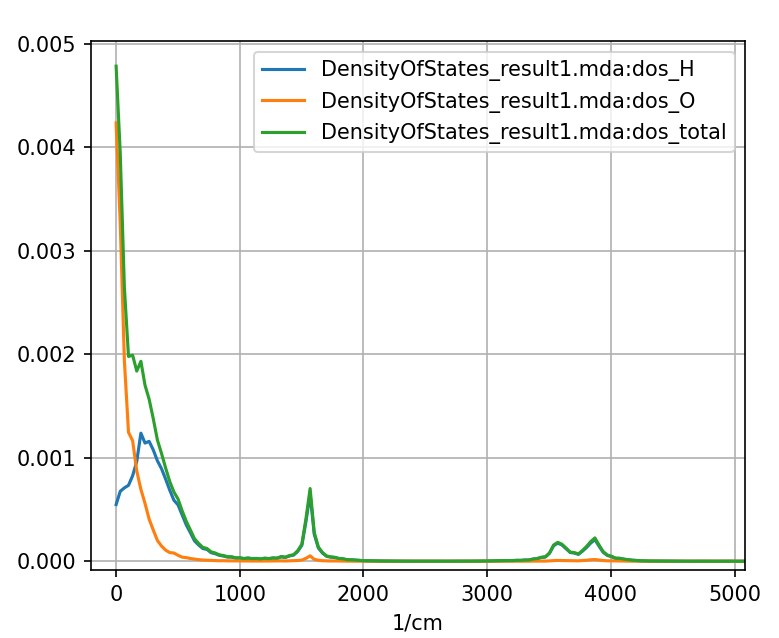
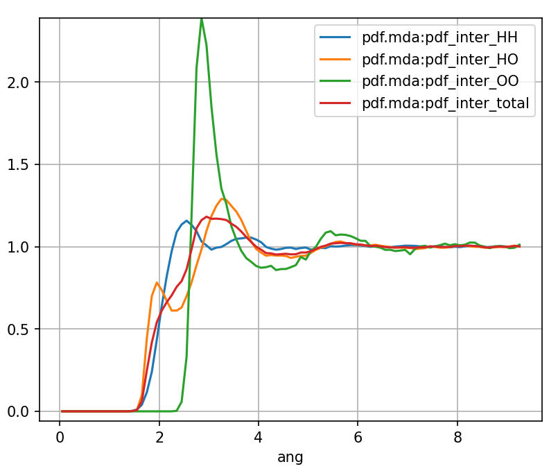

Weighting Scheme
================

In MDANSE, most properties are split by atom-type
and the total results is a sum of these partial
properties. For example, the coherent and incoherent intermediate
scattering functions are

.. math::
   :label: ws1

   F_{\text{coh},\alpha\beta}{(\mathbf{q},t) =  \frac{W_{\alpha\beta}}{N \sqrt{c_{\alpha}c_{\beta}}}}{\sum\limits_{j}^{N_{\alpha}}{\sum\limits_{k}^{N_{\beta}}\left\langle {\exp\left\lbrack {{- i}\mathbf{q}\cdot\mathbf{r}_{j}\left( 0 \right)} \right\rbrack\exp\left\lbrack {i\mathbf{q}\cdot\mathbf{r}_{k}\left( t \right)} \right\rbrack} \right\rangle}},

.. math::
   :label: ws2

   F_{\text{inc},\alpha}{(\mathbf{q},t ) = \frac{W_{\alpha}}{Nc_{\alpha}}}{\sum\limits_{j}^{N_{\alpha}}\left\langle {\exp\left\lbrack {{- i}\mathbf{q}\cdot\mathbf{r}_{j}\left( 0 \right)} \right\rbrack\exp\left\lbrack {i\mathbf{q}\cdot\mathbf{r}_{j}\left( t \right)} \right\rbrack} \right\rangle}

where :math:`\alpha` and :math:`\beta` are the atom-types.
:math:`W_{\alpha\beta}` and :math:`W_{\alpha}` are the weights of the
atom-type pairs :math:`\alpha\beta` and the atom type :math:`\alpha`.
:math:`c_{\alpha} = N_{\alpha} / N` and :math:`c_{\beta} = N_{\beta} / N` are the concentrations of atoms of
atom-types :math:`\alpha` and :math:`\beta` and :math:`N_{\alpha}`,
:math:`N_{\beta}`, and :math:`N` are the :math:`\alpha`, :math:`\beta`,
and the total number of atoms. The total is now a sum of the partial terms

.. math::
   :label: ws3

    F_{\text{coh}}(\mathbf{q},t) = \sum_{\alpha}\sum_{\beta \geq \alpha} F_{\text{coh},\alpha\beta}(\mathbf{q},t),

.. math::
   :label: ws4

    F_{\text{inc}}(\mathbf{q},t) = \sum_{\alpha} F_{\text{inc},\alpha}(\mathbf{q},t).

Note that for summation involving two atom-types only the unique pairs
are summed up. This is because in MDANSE the off-diagonal weight
terms are doubled and and we assumed that
:math:`F_{\text{coh},\alpha\beta} = F_{\text{coh},\beta\alpha}`.

.. _water-dos-weighted:

   The total and partial DOS of water, partial DOS are **weighted** so that the
   sum of partial DOS equals to the total.

The partial properties can also be scaled without the weights

.. math::
   :label: ws5

   \mathcal{F}_{\text{coh},\alpha\beta}{(\mathbf{q},t) = \frac{1}{N c_{\alpha} c_{\beta}}}{\sum\limits_{j}^{N_{\alpha}}{\sum\limits_{k}^{N_{\beta}}\left\langle {\exp\left\lbrack {{- i}\mathbf{q}\cdot\mathbf{r}_{j}\left( 0 \right)} \right\rbrack\exp\left\lbrack {i\mathbf{q}\cdot\mathbf{r}_{k}\left( t \right)} \right\rbrack} \right\rangle}},

.. math::
   :label: ws6

   \mathcal{F}_{\text{inc},\alpha}{(\mathbf{q},t ) = \frac{1}{N c_{\alpha}}}{\sum\limits_{j}^{N_{\alpha}}\left\langle {\exp\left\lbrack {{- i}\mathbf{q}\cdot\mathbf{r}_{j}\left( 0 \right)} \right\rbrack\exp\left\lbrack {i\mathbf{q}\cdot\mathbf{r}_{j}\left( t \right)} \right\rbrack} \right\rangle}

so the total will now be a weighted sum of these partial terms

.. math::
   :label: ws7

    F_{\text{coh}}(\mathbf{q},t) = \sum_{\alpha}\sum_{\beta \geq \alpha} W_{\alpha\beta} \mathcal{F}_{\text{coh},\alpha\beta}(\mathbf{q},t),

.. math::
   :label: ws8

    F_{\text{inc}}(\mathbf{q},t) = \sum_{\alpha} W_{\alpha} \mathcal{F}_{\text{inc},\alpha}(\mathbf{q},t).

In the MDANSE_GUI you have the option to plot either weighted (e.g. :math:`F_{\text{coh},\alpha\beta}`
and :math:`F_{\text{inc},\alpha}`) or unweighted (e.g. :math:`\mathcal{F}_{\text{coh},\alpha\beta}`
and :math:`\mathcal{F}_{\text{inc},\alpha}`) partial properties.

.. _water-pdf-unweighted:

   The total and partial intermolecular PDF of water, partial PDF are
   **unweighted** so that the weighted sum of partial PDF equals to the total.

The weighted and unweighted options are more useful for different cases, for example,
it might be more useful to use the weighted terms for the density of states (DOS) calculations (:numref:`water-dos-weighted`)
while the unweighted terms might be more useful of the pair distribution function (PDF) calculations (:numref:`water-pdf-unweighted`).

Rescaled Weights
^^^^^^^^^^^^^^^^

Single Atom-Type Properties
~~~~~~~~~~~~~~~~~~~~~~~~~~~

MDANSE weights are rescaled so that weights for DISF calculation using the ``b_incoherent2`` will be

.. math::
   :label: ws9

   W_{\alpha} = \frac{c_{\alpha} b_{\mathrm{inc},\alpha}^2}{\sum_{\gamma} c_{\gamma} b_{\mathrm{inc},\gamma}^2}

where :math:`b_{\mathrm{inc},\alpha}^2` is the square of the incoherent
scattering length of the atom type :math:`\alpha`. By using these rescaled
weights the total incoherent intermediate scattering functions becomes

.. math::
   :label: ws10

   F_{\text{inc}}{(\mathbf{q},t ) = \frac{1}{\sum_{\gamma} c_{\gamma}   b_{\mathrm{inc},\gamma}^2 } \frac{1}{N}}{\sum\limits_{j} b_{\mathrm{inc},\alpha}^2 \left\langle {\exp\left\lbrack {{- i}\mathbf{q}\cdot\mathbf{r}_{j}\left( 0 \right)} \right\rbrack\exp\left\lbrack {i\mathbf{q}\cdot\mathbf{r}_{j}\left( t \right)} \right\rbrack} \right\rangle}

Notice that by using this weight scheme the total DISF has the property that

.. math::
   :label: ws11

   F_{\text{inc}}(\mathbf{q},t=0) = 1.

Double Atom-Type Properties (DCSF and CCF)
~~~~~~~~~~~~~~~~~~~~~~~~~~~~~~~~~~~~~~~~~~

For the DCSF calculation using ``b_coherent``, the weights are

.. math::
   :label: ws12

   W_{\alpha\beta} = \left[2 - \delta_{\alpha\beta}\right]\frac{\sqrt{c_{\alpha}c_{\beta}} b_{\mathrm{coh},\alpha}b_{\mathrm{coh},\beta}}{\sum_{\gamma\delta} c_{\gamma}c_{\delta}  b_{\mathrm{coh},\gamma}b_{\mathrm{coh},\delta}}.

where :math:`b_{\mathrm{coh},\alpha}` and :math:`b_{\mathrm{coh},\beta}` are
the coherent scattering lengths of the atoms of types :math:`\alpha` and :math:`\beta`.
The total coherent intermediate scattering functions becomes

.. math::
   :label: ws13

   F_{\text{coh}}{(\mathbf{q},t) = \frac{1}{\sum_{\gamma\delta} c_{\gamma} c_{\delta}  b_{\mathrm{coh},\gamma}b_{\mathrm{coh},\delta}} \frac{1}{N}}{{\sum\limits_{jk} b_{\mathrm{coh},j}b_{\mathrm{coh},k} \left\langle {\exp\left\lbrack {{- i}\mathbf{q}\cdot\mathbf{r}_{j}\left( 0 \right)} \right\rbrack\exp\left\lbrack {i\mathbf{q}\cdot\mathbf{r}_{k}\left( t \right)} \right\rbrack} \right\rangle}},

where :math:`b_{\mathrm{coh},j}` and
:math:`b_{\mathrm{coh},k}` are the coherent scattering lengths of
atoms :math:`j` and :math:`k`. Notice that the total intermediate scattering function
(sum of the incoherent and coherent parts) will not be equal (or equal to the
sum by some scaling factor) to the to the sum of intermediate scattering function
from the DISF and DCSF calculations using the scaled weight scheme since they
are not scaled in the same way.

Double Atom-Type Properties (Other)
~~~~~~~~~~~~~~~~~~~~~~~~~~~~~~~~~~~

For calculation other than the DCSF and current correlation function (CCF)
a slightly different weight scheme must be used as their partials are
normalized slightly differently. In MDANSE the (weighted) partial static structure
factor (SSF) is

.. math::
    :label: ws15

    S_{\alpha\beta}(q) = W_{\alpha\beta} \left[ 1 + \frac{4 \pi \rho}{q} \int_{0}^{\infty} \mathrm{d}r  \, \left[ g_{\alpha\beta}(r) - 1\right] r\sin(qr)\right]

where

.. math::
    :label: ws16

    g_{\alpha\beta}(r) = \frac{1}{N c_{\alpha} c_{\beta}} \sum_{j}^{N_\alpha} \sum_{k\neq j}^{N_\beta}  \left\langle \delta(r - \vert \mathbf{r}_{k} + \mathbf{r}_{j} \vert ) \right\rangle

are the partial PDFs. Using ``b_coherent``, the weights are

.. math::
   :label: ws17

   W_{\alpha\beta} = \left[2 - \delta_{\alpha\beta}\right]\frac{c_{\alpha}c_{\beta} b_{\mathrm{coh},\alpha}b_{\mathrm{coh},\beta}}{\sum_{\gamma\delta} c_{\gamma}c_{\delta}  b_{\mathrm{coh},\gamma}b_{\mathrm{coh},\delta}}.

notice that the concentrations :math:`c_{\alpha}c_{\beta}` are not
square-rooted, this is because the the partial SSF has a prefactor of
:math:`1 / N c_{\alpha}c_{\beta}` while DCSF and CCF calculations have a
prefactor of :math:`1 / N \sqrt{c_{\alpha}c_{\beta}}`.
